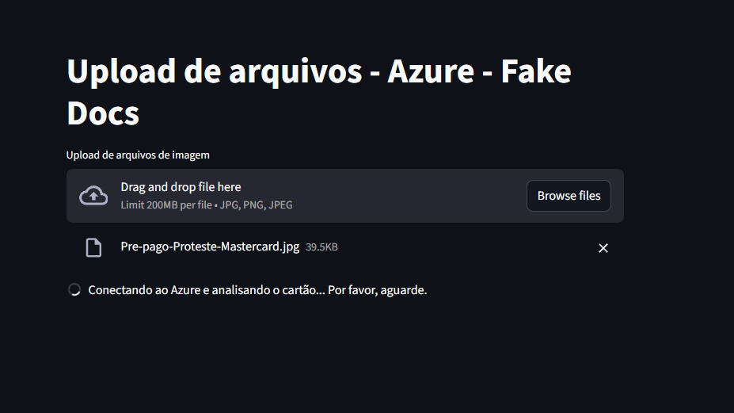
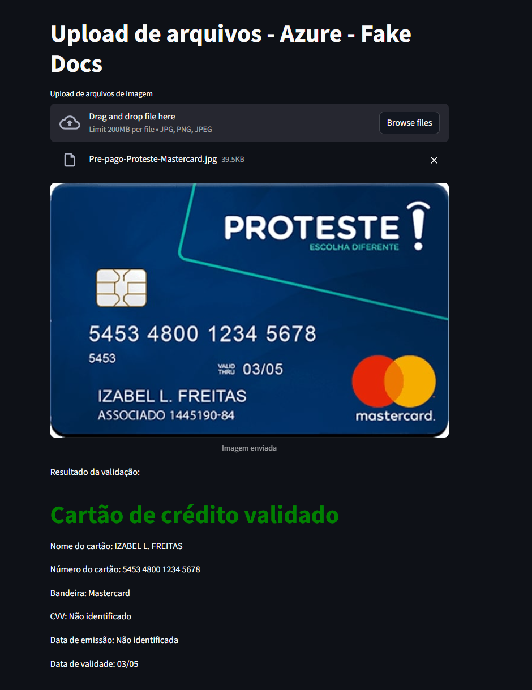

# 🛡️ Anti-Fraud Credit Card Validator - Azure AI

Este projeto é uma ferramenta de **Inteligência Artificial aplicada a Finanças**. Ele utiliza o serviço **Azure AI Document Intelligence** para ler e validar informações de cartões de crédito a partir de imagens, automatizando processos que antes seriam manuais e propensos a erros.




## 🚀 Tecnologias Utilizadas
* **Python 3.10+**
* **Streamlit**: Interface web interativa.
* **Azure Document Intelligence**: Extração de dados com IA.
* **Azure Blob Storage**: Armazenamento seguro de imagens.
* **Python-dotenv**: Gerenciamento de variáveis de ambiente.

## 🛠️ Funcionalidades
- [x] **Upload de Imagens**: Suporte para JPG, PNG e JPEG.
- [x] **OCR Avançado**: Extração de Nome do Titular, Número e Data de Validade.
- [x] **Lógica de Negócio**: Identificação automática da bandeira (Visa, Mastercard, Amex) via BIN.
- [x] **Validação de Integridade**: Sistema que detecta se o número do cartão está incompleto ou ilegível.
- [x] **Segurança**: Integração com armazenamento em nuvem e proteção de chaves via `.env`.

## 📁 Estrutura do Projeto
```text
PROJETO-ANTIFRAUDE/
├── src/
│   ├── app.py                # Interface Streamlit
│   ├── services/
│   │   ├── blob_service.py    # Integração com Storage
│   │   └── credit_card_service.py # Lógica de IA e Validações
│   └── utils/
│       └── Config.py          # Configurações de ambiente
├── .env.example              # Modelo de variáveis de ambiente
├── requirements.txt          # Dependências do projeto
└── README.md
```

## Como Rodar o Projeto
Clone o repositório:

```
git clone [https://github.com/seu-usuario/seu-repositorio.git]
```

Instale as dependências:
```
pip install -r requirements.txt
```

Configure as chaves do Azure:
Crie um arquivo .env na raiz seguindo o modelo do .env.example:
```
Code snippet
ENDPOINT=sua_url_da_azure
SUBSCRIPTION_KEY=sua_chave
STORAGE_CONNECTION_STRING=sua_conexao_blob
CONTAINER_NAME=seu_container
```

Execute a aplicação:
```
streamlit run src/app.py
```

Aprendizados (AI-102)
Este projeto faz parte dos meus estudos para a certificação Microsoft Azure AI Engineer Associate (AI-102), cobrindo tópicos como:

Consumo de APIs de Inteligência Artificial.

Gestão de recursos em nuvem.

Tratamento de Long Running Operations (LRO).


